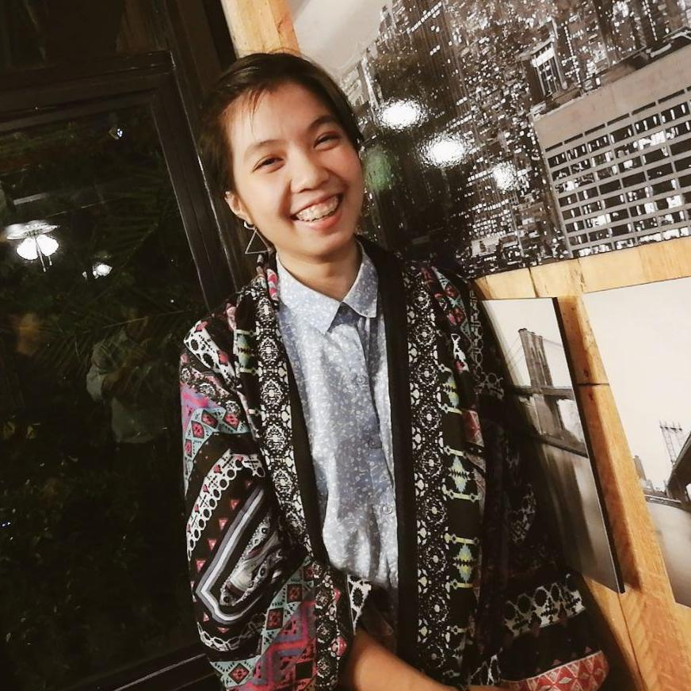
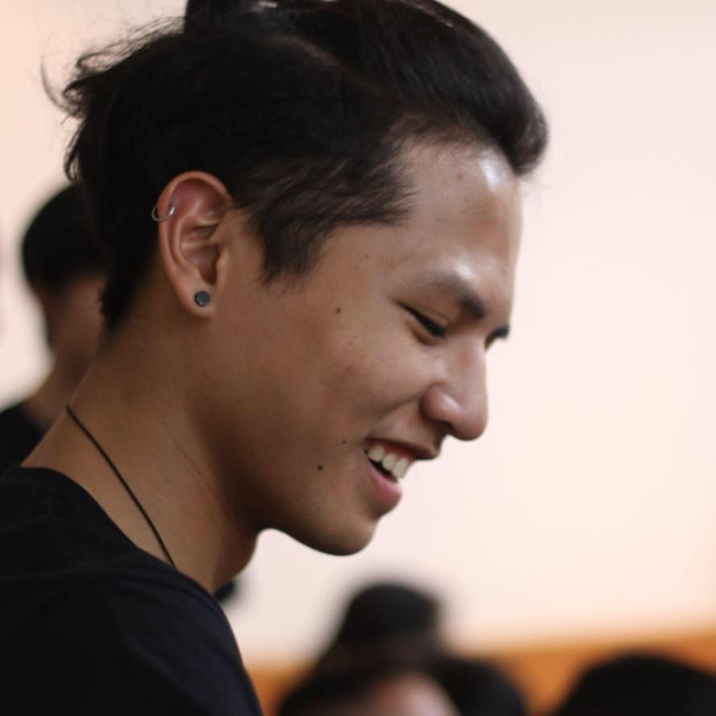
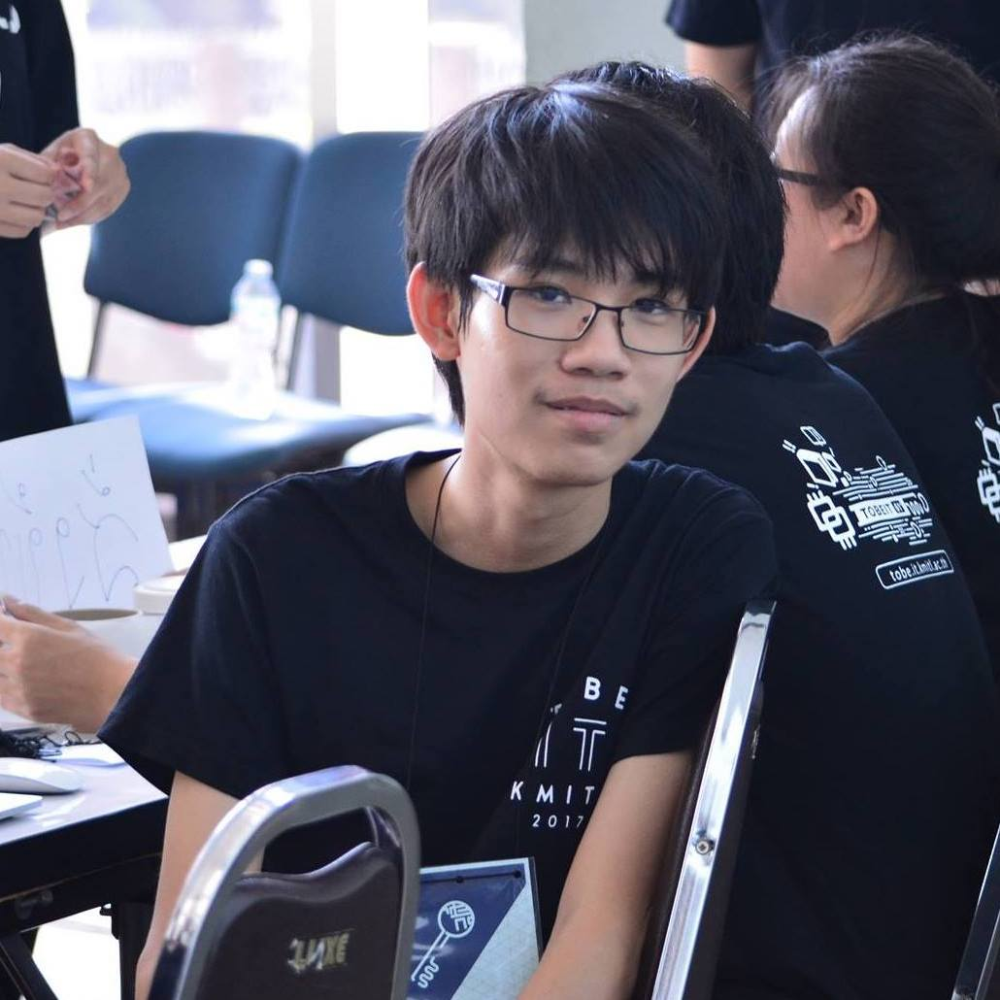
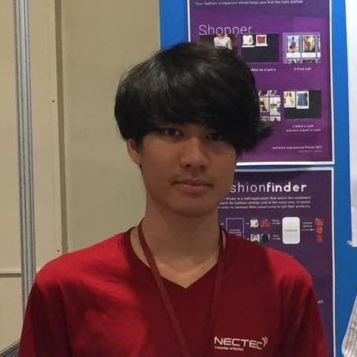

# Introduction to Pre Programming 2018
สวัสดีครับน้อง ๆ ❤️
<br>
พี่ ๆ ก็ขอต้อนรับน้อง ๆ อีกครั้งนึงนะครับ Repo นี้จะบอกกำหนดการและข้อมูล Pre-Programming Preparatory Course ของปี 2018 นะครับ โดยการอัปเดตเรื่องกำหนดการและข้อมูลต่าง จะใช้ Repo นี้เป็นตัวหลักนะครับ
<br>
<br>
คอร์สนี้จะเป็นเรื่องการใช้ Algorithm และ Basic Programming ซึ่งภาษาหลักของเราที่จะใชนั้นก็คือ Python นั้นเอง โดยทั้ง 2 อย่างนั้นจะเป็นพื้นฐานหลักในวิชา Problem Solving in Information Technology (PSIT) ในปี 1 เทอม 1

> ดังนั้น พี่ ๆ อยากให้น้องตั้งใจในการเรียนรู้ ขยัน หมั่นทำโจทย์ ไม่เข้าใจให้ถาม แล้วชีวิตของน้องจะสดใส จากความห่วงใยของพี่ ๆ
---
# กำหนดการ Pre-Programming


|วันที่ 23 เมษายน - 14 พฤษภาคม 2018|วันที่ 26 พฤษภาคม - 22 มิถุนายน 2018|วันที่ 25 มิถุนายน - 20 กรกฎาคม 2018 |
|:-------:|:----:|:-------:| 
|รับสมัครน้องๆ เข้า Course Pre Programming<br>(รับสมัครผ่านทาง Google Form)|Pre Programming รอบ Online<br>(ผ่านระบบ Ejudge)|Pre Programming รอบ Onsite<br>(ณ คณะเทคโนโลยีสารสนเทศ)|
|Status: `CLOSED` | Status: `Active` | Status: `Inactive`|

>ปิดการรับสมัครแล้ว หากอยากเรียนติดต่อพี่ ๆ ได้เลยครับ

### รายชื่อผู้ผ่านการทดสอบ

**ตามนี้เลยครับ 👉 [Pre-Programming Attendance Status](https://docs.google.com/spreadsheets/d/1BEcazbkEzYYvQbfI2gVfNwORDpj98aHv2urtFBytxDA/edit?usp=sharing)**


หากน้องไม่พบชื่อตัวเอง ไม่ต้องตกใจนะครับ พี่ ๆ จะคอยอัปเดตนะ ส่วนคนทีขึ้นว่าไม่ผ่านไม่ต้องตกใจนะครับ น้อง ๆ ไม่ผ่านอาจจะเป็นเพียงแค่ข้อมูลไม่ครบหรือตกหล่น สามารถแก้ไขได้ ให้น้องติดต่อพี่ ๆ ได้เลยนะครับ

> ติดตามในกลุ่ม [ITKMITL Pre-Programming 61](https://www.facebook.com/groups/2073882202847693/)
# What is eJudge?

ระบบ eJudge เป็นระบบ Grader ชนิดหนึ่ง ที่จะรับโปรแกรมของน้อง ๆ มา แล้วรัน โดยการใส่ค่า Input ที่พวกพี่ ๆ ที่ออกโจทย์เขียนเอาไว้ และรับค่า Output ที่ผ่านโปรแกรมนั้น ๆ ออกมา
โดยระบบจะสามารถเช็คได้ถึง

* **ความมีระเบียบ** ในการเขียนโปรแกรม (คุณภาพ)
* **ความคล้ายคลึงใน Algorithm** ในโปรแกรมน้อง ๆ กับเพี่อนของน้อง ๆ
* **ความถูกต้องในผลลัพท์** ที่ออกมาจากโปรแกรมที่น้องๆเขียนมา
* **เก็บคะแนน** และเก็บไฟล์ที่น้องเคยส่งมาทั้งหมด

> [ E-Judge Grader ITKMITL ](https://ejudge.it.kmitl.ac.th/)

โดยน้องๆก็จะเจอกับระบบนี้ไปอีกนาน เพราะน้องต้องเรียนกับมัน สอบกับมัน ทำ Quiz กับมัน ดังนั้น ก็ให้เข้าใจและชินไปกับระบบครับ


วิธีระบบ eJudge คำนวณคะแนน
หากน้องทำได้เพียง 9 ใน 10 testcase ได้ถูกต้อง และคะแนนต่อข้อ = 100 คะแนน และระดับความยาก = 5 และ ทำคุณภาพ code ระดับไม่มีที่ติ


|Testcase Score|Difficulty|Perfect bonus score|Quality|Total|
|:------------:|:----------:|:-------------------:|:-------:|:-----:|
|(9/10) x 100  |x5        |100 x 5 x 0        |100%   |90 x 5 x 1 + 0 = 450|


หากน้องทำได้ 10 ใน 10 testcase ได้ถูกต้อง และคะแนนต่อข้อ = 100 คะแนน
และระดับความยาก = 5 และ ทำคุณภาพ code ระดับไม่มีที่ติ

|Testcase Score|Difficulty|Perfect bonus score|Quality|Total|
|:------------:|:--------:|:-----------------:|:-----:|:---:|
|(10/10) x 100 |x5        |100 x 5 x 2        |100%   |100 x 5 x 1 + 500 = 1000|

>
> เห็นความแตกต่างนั้นมั้ยเอ่ย? 450 กับ 1000 คะแนน? Welcome to the PSIT.
>

# Why Python?

น้องอาจจะไม่เข้าใจ ว่าทำไมเราต้องมาเรียน Python ด้วย ทำไมไม่เรียน C/Java ก่อน หรือ ไม่เรียน Ruby หรือ Swift ก่อน เพื่อเป็นการเรียนวิธีคิด พี่อยากจะบอกข้อดีของ Python ให้น้องฟังครับ

- **Speed** - น้องจะสามารถเขียนภาษานี้ได้เร็ว เพราะเป็นภาษา High Level

- **Integrations** - ระบบต่าง ๆ นั้นรองรับภาษา Python ทั้งหมด หากไม่รองรับ ก็สามารถใช้ Library เพื่อให้มันรองรับได้

- **Compatibility** - ใช้ได้กับทุกแพลตฟอร์มหลัก ๆ เช่น Windows (.NET) และ UNIX (MacOS & Linux Distribution & Android)

> "Python is easy to learn and use, but powerful enough to tackle even the most difficult problems. It integrates well with existing IT infrastructure, and is very platform independent." - Continuum

# เนื้อหาการเรียนรอบ Online

<table>
	<tr align="center">
		<th>Week</th>
		<th>Date</th>
		<th>Topic</th>
		<th colspan="2">Instructors</th>
	</tr>
	<tr></tr>
	<tr align="center">
		<td rowspan="4">1</td>
		<td rowspan="4">28th May - 3rd June 2018</td>
		<td rowspan="2">Introduction to Pre-Programming</td>
		<td><a href="https://www.facebook.com/jusmistic" target="_blank"></a></td>
		<td><a href="https://www.facebook.com/Naruebet.Coke" target="_blank"></a></td>
	</tr>
	<tr align="center">
		<td>พี่กรรณ</td>
		<td>พี่โค้ก</td>
	</tr>
	<tr align="center">
		<td rowspan="2">Python Basics</td>
		<td><a href="https://www.facebook.com/kawisara.srn" target="_blank"></a></td>
		<td><a href="https://www.facebook.com/FlukePiyapol" target="_blank"></a></td>
	</tr>
	<tr align="center">
		<td>พี่การ์ตูน</td>
		<td>พี่ฟลุ๊ค (ปิยะพล)</td>
	</tr>
	<tr align="center">
		<td rowspan="2">2</td>
		<td rowspan="2">4th June - 10th June 2018</td>
		<td rowspan="2">Functions</td>
		<td><a href="https://www.facebook.com/khing.bcc" target="_blank"></a></td>
		<td><a href="https://www.facebook.com/pdmn.diff" target="_blank"></a></td>
	</tr>
	<tr align="center">
		<td>พี่ขิง</td>
		<td>พี่ดิฟ</td>
	</tr>
	<tr align="center">
		<td rowspan="2">3</td>
		<td rowspan="2">11th June - 17th June 2018</td>
		<td rowspan="2">Conditions</td>
		<td><a href="https://www.facebook.com/profile.php?id=100002495318131" target="_blank"></a></td>
		<td><a href="https://www.facebook.com/Phongsathron.co.th" target="_blank"></a></td>
	</tr>
	<tr align="center">
		<td>พี่ป๊อก</td>
		<td>พี่ฟลุ๊ค (พงศธร)</td>
	</tr>
	<tr align="center">
		<td rowspan="2">4</td>
		<td rowspan="2">18th June - 24th June 2018</td>
		<td rowspan="2">Loops</td>
		<td><a href="https://www.facebook.com/810Teams" target="_blank"></a></td>
		<td><a href="https://www.facebook.com/nutorbitx" target="_blank"></a></td>
	</tr>
	<tr align="center">
		<td>พี่เซ้นท์</td>
		<td>พี่ณัฏฐ์</td>
	</tr>
</table>

> ##  References
>
>
> 
>
> Think Python 2 (หนังสือเดียวที่เอาเข้าห้องสอบได้) <br>
> http://greenteapress.com/thinkpython2/thinkpython2.pdf
>
> Python Tutor (Python Cloud Debugger ทำงานทีละบรรทัด)
> http://www.pythontutor.com
>
> Python Organizations (Document หลักของ Python)
> https://docs.python.org/3/

---
# การเตรียมตัวก่อน Onsite**

## เรียน Onsite
การเรียน Onsite นี้จะแตกต่างกับรอบ Online ในระดับหนึ่ง เพราะจะเป็นการใช่เครื่องมือที่หลากหลายขึ้น (หรือในท่าที่ยากขึ้น) ต่างจากรอบ Online ที่พี่ ๆ ให้น้อง ๆ ฝึกให้น้อง วาง Algorithm เป็น และใช้เครื่องมือได้

## มา Onsite กันเถอะ

การเรียน onsite จะเรียนทั้งหมด 4 week จันทร์ - ศุกร์ เริ่ม วันที่ 25 มิถุนายน ถึง 20 กรกฎาคม 2018 

การเรียน onsite ให้ใส่ชุดธรรม สุภาพเรียบร้อย
* เสือยืดหรือเสื้อที่มันสุภาพๆ
* กางเกงขายาว
* รองเท้าผ้าใบ

>โดยหากมีข้อสงสัย หรือ ต้องการความช่วยเหลือ ติดต่อพี่ ๆ ได้เลยนะครับ

## การเดินทางระหว่างมหาลัยและบ้าน

### สำหรับสถานีสำคัญต่างๆ

#### อนุสาวรีย์ชัย/พญาไท 
* นั่งรถตู้สาย 156 เขียนว่าไปเทคโนลาดกระบัง
หรือใครจะนั่งรถไฟมาก็ได้นะ ขึ้นตรงที่หยุดพญาไท ใต้ BTS พญาไท ลงหัวตะเข้นะน้อง

#### หมอชิต 2/บางซื่อ 
* นั่งรถตู้สาย 144 เขียนว่าไปเทคโนลาดกระบัง

#### รังสิต/ฟิวเจอร์/ปทุมธานี 
* นั่งรถตู้สาย 554A เขียนว่าไปเทคโนลาดกระบัง (รถจอดหน้าฟิวเจอร์เลยจร้า~)

#### แฮปปี้แลนด์/บางกะปิ/ลาดพร้าว
* นั่งรถตู้สาย 50B เขียนว่าไปเทคโนลาดกระบัง(รถจอดข้างห้างน้อมจิตต์นะจะ~) 

#### ซีคอนสแควร์/สวนหลวง
* นั่งรถตู้สาย ที่เขียนว่าไปเทคโนลาดกระบัง ขออภัยจำเบอร์ไม่ได้ อิอิ (รถจอดหน้าห้างซีคอน~) หรือใครจะนั่ง 1013 มาก็ได้นะ มาต่อหัวตะเข้อีกที

#### สายใต้ใหม่/ตลิ่งชัน
`อันนี้ค่อนข้างโหดนิดนึง`

1. สายราง 
*ขึ้นรถไฟตรงสถานีชุมทางตลิ่งชัน ต่อเข้ากรุงเทพ (เรียก EZ ได้ว่าหัวลำโพง) แล้วต่อรถไฟอีกต่อมาลงหัวตะเข้
2. สายด่วน 
*นั่งรถตู้อะไรก็ได้มาลงอนุสาวรีย์ชัย แล้วต่อรถตู้ที่พี่เขียนไว้ข้างบนโลด~

### สำหรับคนใกล้แนวรถไฟฟ้า

นั่งรถไฟฟ้ามาต่อ Airport Link ที่ BTS พญาไท แล้วลงที่สถานีลาดกระบัง เสร็จแล้วมาต่อ 2 แถวที่เขียนว่า 
เข้าเทคโนคันสีส้มๆได้เลย 

### สำหรับโซนนอกเมืองอื่นๆ
* ฉะเชิงเทรา 
รถไฟเร็วที่สุด ลงหัวตะเข้ 
* มีนบุรี 
รถตู้สาย 1517/23A* เขียนว่าไปเทคโนลาดกระบัง รถจอดตรงข้างอู่รถเมล์ 
*บางคันไปไม่ถึง ถามคนขับด้วยนะ 
* ปากน้ำ/บางนา 
นั่งรถมาลงตรง BTS พระโขนง แล้วต่อ 1013 โลด ต่อสองแถวตรงหัวตะเข้อีกที 
* หลักสี่/ดอนเมือง 
รถเมล์ 554 เร็วสุดพี่นั่งมาแล้ว ไปต่อมีนบุรีมันช้ากว่า รถจะสุดทางที่สนามบิน ให้นั่งรถเวียนออกมาแล้วนั่งสองแถวต่อเข้าไปอีกที 

### สำหรับคนใกล้เทคโน

สองแถว ปี้นๆ เยอะมาก ถ้าไม่มีมาไปเทคโนเลย ก็ให้นั่งที่เขียนว่าหัวตะเข้ก็ได้ แล้วก็นั่งรถต่อเข้าไปอีกที 

### สำหรับคนไม่รู้ทางเลย

ถามพี่ๆซะ 555555555 ไม่กัดแน่นอน อิอิอิอิอิ #ฉีดยาแล้ว


## หาที่อยู่ (หอพัก) ** ควรรีบหาแล้วนะเดี๋ยวจะไม่มีที่นอน
สำหรับน้องที่มาจากต่างจังหวัดหรือมีประสงค์ที่จะพักแถวสถาบันพี่ก็มีโซนแนะนำหลักๆ ดังนี้

1. เกกี [อยู่แถวนี้](https://goo.gl/maps/pX5ARMGMNZ62)
2. หอพักของมหาลัย [อยู่แถวนี้](https://goo.gl/maps/kaqZHBVJKYB2)
3. หน้ามหาลัย [อยู่แถวนี้](https://goo.gl/maps/NdyzVqv88iw)
4. ถนนฉลองกรุง [อยู่แถวนี้](https://goo.gl/maps/iSWHjzZ3Hyx)
5. V Condo [อยู่แถวนี้](https://goo.gl/maps/Yr212K2WBxK2)

# การรายงานตัว
การรายตัวของสถาบันนั้นจะแบ่งเป็น `2 ช่วง` นั้นก็คือ


|การรายงานตัวรอบที่ 1|การรายงานตัวรอบที่ 2|
|-----------------|-----------------|
|วันที่ 11 - 13 กรกฎาคม 2018|วันที่ 1 - 3 สิงหาคม 2018 |

ซึงการรายงานตัวของคณะเรานั้นตรงกับวัน `พุธที่ 11 กรกฎาคม 2018` หรือ `Week 3 ของ Onsite`

ดังนั้นน้องที่อยู่ต่างจังหวัด หรือ ที่พักอาศัยอยู่บริเวณหอพักของสถาบัน พี่ ๆ แนะนำว่าให้ทำการเตรียมเอกสารการรายงานตัวให้เรียบร้อย `อย่างน้อยล่วงหน้า 1 สัปดาห์` โดยสำหรับข้อมูล ต้องเอาอะไรไปบ้าง และเวลาไหน ที่ไหน ให้ดูในตารางการรายงานตัวนะครับ [KMITL Registeration Website](http://www.reg.kmitl.ac.th/educalendar/index.php)

ที่หลักๆ ก็จะมีตามเช็คลิสต์นี้
```
1. เอกสารการตรวจร่างกาย โดยที่ต้องไปโหลดฟอร์มบนเว็บไซต์ reg.kmitl.ac.th
2. ใบ ปพ. 1 (จริง 1 ชุด สำเนา 2 ชุด)
3. สำเนาบัตรประชาชน 2 ชุด
```

ซึ่งในวันที่รายงานตัวน้องๆทุกคนต้องแต่งการเรียบร้อย ตามระเบียบของทางสถาบันนะครับ

## เครื่องแต่งการ (ชุดนักศึกษา)
เครื่องแต่งกาย จะนำมาขายที่คณะ ตอน Week 1 และ Week 4 นะครับ โดย ณ วันนั้นจะมีของดังนี้ครับ
* เสื้อนักศึกษา ชายและ หญิง
* กางเกงของนักศึกษาชาย
* กระโปรงพลีท
* กระโปรงพิธีการ
* กระดุม (นักศึกษาหญิง)
* เข็มขัดและหัวเข็มขัด (นักศึกษาชายและหญิง)

***เน็คไทและเข็มนักศึกษาจะได้รับหลังจากการทำพิธีมอบเน็คไทและเข็ม***
>สำหรับน้องๆที่จะไปซื้อชุดนักศึกษาด้วยตนเองนะครับ
[ระเบียบการแต่งการของนักศึกษา](http://www.reg.kmitl.ac.th/filecontainer/files/a464.pdf)


________________

## Have fun with code
<p align="center">
<a href="https://www.facebook.com/%E0%B8%A3%E0%B8%B1%E0%B8%9A%E0%B8%99%E0%B9%89%E0%B8%B3%E0%B8%82%E0%B8%B4%E0%B8%87%E0%B8%A3%E0%B9%89%E0%B8%AD%E0%B8%99%E0%B9%86%E0%B8%AA%E0%B8%B1%E0%B8%81%E0%B9%81%E0%B8%81%E0%B9%89%E0%B8%A7%E0%B8%A1%E0%B8%B1%E0%B9%89%E0%B8%A2%E0%B8%84%E0%B8%A3%E0%B8%B1%E0%B8%9A-181076956001154/"></a>
</p>

## Master Ginger รับน้ำขิงร้อนๆซักแก้วมั้ยครับ

___
## Special Thanks
|<a href="https://github.com/sagelga"></a>  |
|:-:|
|@sagelga|


## Executive Team
|<a href="https://www.facebook.com/rawitgun"></a>  |<a href="https://www.facebook.c om/wiput.pootong"></a>  |<a href="https://www.facebook.com/810Teams"></a>  |<a href="https://www.facebook.com/pipatboon"></a>  |<a href="https://www.facebook.com/kavepol"></a>  |
|:-:|:-:|:-:|:-:|:-:|
|[@RawitSHIE](https://github.com/rawitshie)|[@wiput1999](https://github.com/wiput1999)|[@810Teams](https://github.com/810Teams)|@Kodashi|@Supermalonz|
|Chief Executive|Chief Ejudge Problem|Chief Teaching Director|Chief Documentation|Chief Registeration|
## Teaching Director
||||||
|:-:|:-:|:-:|:-:|:-:|
|Saint|Gun|Cartoon|Khing|Pok|

||||||
|:-:|:-:|:-:|:-:|:-:|
|Coke|Fluke|Diff|Fluke|Nut|


## Teaching Assistant
*comming soon* พี่เยอะจัด 

[](https://forthebadge.com)
[](https://forthebadge.com)
