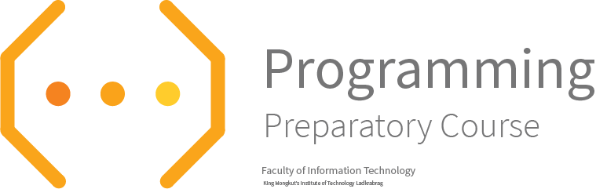

# Introduction to Pre Programming 2561
สวัสดีครับ พี่ชื่อคุมะมง :bear::black_circle::jp: (หรืออยากเรียกว่าพี่มง ก็ตามสบายจ้า)

เป้าหมายของ Repository นี้คือการให้น้องเรียนรู้ด้วยตนเองนะครับและลองอ่านและทำความเข้าใจโค้ดของเพื่อนๆ หรือ ของพี่มงเอง โดยมีอาจารย์ โชคิพัฒน์ และเพื่อนๆ IT15 หวังว่าน้องจะได้อะไรจากการเรียน Pre Programming นะครับ

> "Python is easy to learn and use, but powerful enough to tackle even the most difficult problems. It integrates well with existing IT infrastructure, and is very platform independent." -- Continuum

พี่จึงหวังว่า การที่พี่ทำให้น้องมากขนาดนี้ น้องจะอยากขนขวาย และเข้าใจความ Python ได้อย่างลึกซื้งมากขื้น เพื่อคะแนน PSIT ที่ดี และดีอย่างยั่งยืน ไม่อ่อนและตายจากพี่ๆไปซะก่อนนะจ๊ะ

---
# กำหนดการ Pre-Programming

|วันที่ 23 - |วันที่ 23 -|วันที่ 23 -|
|---------|------|---------|
|รับสมัครนักศึกษา เข้า cource Pre Programming|Pre Programming รอบ Online|Pre Programming รอบ Onsite|

# What is EJudge? by P'Kumamon

ระบบ Ejudge เป็นระบบ Grader ชนิดหนึ่ง ที่จะรับโปรแกรมของน้องๆมา แล้วรัน โดยการใส่ค่า Input ที่พวกพี่ๆที่ออกโจทย์เขียนเอาไว้ + รับค่า Output ที่ผ่านโปรแกรมนั้นๆออกมา
โดยระบบจะเช็คได้ถึง

1. **ความมีระเบียบ** ในการเขียนโปรแกรม (คุณภาพ)

2. **ความคล้ายคลึงใน Algorithm** ในโปรแกรมน้องๆ กับเพี่อนของน้องๆ

3. **ความถูกต้องในผลลัพท์** ที่ออกมาจากโปรแกรมที่น้องๆเขียนมา

4. **เก็บคะแนน** และเก็บไฟล์ที่น้องเคยส่งมาทั้งหมด

โดยน้องๆก็จะเจอกับระบบนี้ไปอีกนาน เพราะน้องต้องเรียนกับมัน สอบกับมัน ทำ Quiz กับมัน ดังนั้น ก็ให้เข้าใจและชินไปกับระบบครับ

วิธีระบบ Ejudge คำนวณคะแนน
หากน้องทำได้เพียง 9 ใน 10 testcase ได้ถูกต้อง และคะแนนต่อข้อ = 100 คะแนน และระดับความยาก = 5 และ ทำคุณภาพ code ระดับไม่มีที่ติ

|Testcase Score|Difficulty|Perfect bonus score|Quality|Total|
|--------------|----------|-------------------|-------|-----|
|(9/10) x 100  |x5        |100 x 5 x 0        |100%   |90 x 5 x 1 + 0 = 450|

หากน้องทำได้ 10 ใน 10 testcase ได้ถูกต้อง และคะแนนต่อข้อ = 100 คะแนน
และระดับความยาก = 5 และ ทำคุณภาพ code ระดับไม่มีที่ติ

|Testcase Score|Difficulty|Perfect bonus score|Quality|Total|
|--------------|----------|-------------------|-------|-----|
|(10/10) x 100 |	      x5|100 x 5 x 2        |100%   |100 x 5 x 1 + 500 = 1000|

เห็นความแตกต่างนั่นมั้ยเอ่ย? 450 กับ 1000 คะแนน? Welcome to the PSIT.

# เนื้อหาการเรียนรอบ Online อย่างคร่าวๆ
### 0	Creation of Website + Website Hosting on AWS
by P’ Dobakung + P’ Kumamon

Syntax for HTML + CSS / Hosting Website on AWS services

#  References

Think Python 2 (หนังสือเดียวที่เอาเข้าห้องสอบได้)   http://greenteapress.com/thinkpython2/thinkpython2.pdf

Python Tutor (Python Cloud Debugger ทำงานทีละบรรทัด)
http://www.pythontutor.com

Python Organizations (Document หลักของ Python)
https://docs.python.org/3/

---

# Have fun coding!!!

## Follow me on GitHub
|  |
|:-:|  
|@sagelga|

Copyright by P' Kumamon IT14.  
For education purpose only.

